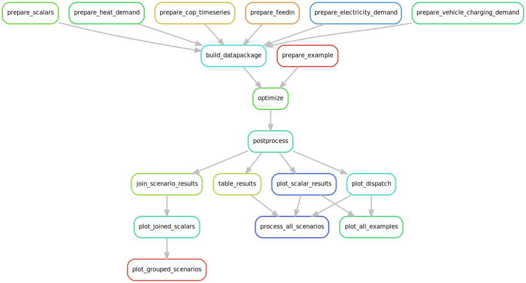

.. _model_pipeline_label:

~~~~~~~~~~~~~~
Model pipeline
~~~~~~~~~~~~~~

.. contents:: `Contents`
    :depth: 2
    :local:
    :backlinks: top

The main functionality of oemof-B3 is a data processing pipeline which is managed using snakemake.
The pipeline preprocesses raw data into scalar and time series resources that is used to
build tabular datapackages representing single energy system optimization problems. These can be
understood by `oemof.tabular <https://github.com/oemof/oemof-tabular>`_ and optimized by
`oemof.solph <https://github.com/oemof/oemof-solph>`_. In the next steps, the results of the
optimization are postprocessed and plotted. The individual steps are documented in detail in the
following sections.

.. created with snakemake --dag results/base-2050/report/ | dot -Tsvg > /docs/_img/model_pipeline.svg

The subdirectories of oemof-B3 shown below contain configurations and data of the model.
:file:`Examples` contains pre-fabricated datapackages that can readily be optimized. The directory
:file:`scenarios` contains :file:`.yml`-files defining individual scenarios. Raw data is not part
of the repo and has to be provided in :file:`raw`. Intermediate and final results will be saved in
:file:`results`. Logs are saved in :file:`logs`.

.. code-block::

    .
    ├── examples
    ├── logs
    ├── oemof_b3
    │     ├── config
    │     ├── model
    │     ├── schema
    ├── raw
    ├── results
    ├── scenarios

Preprocessing
=============

.. toctree::
   :maxdepth: 1
   :glob:

   preprocessing/*

Optimization
============

.. toctree::
   :maxdepth: 1
   :glob:

   optimization/*

Postprocessing
==============

.. toctree::
   :maxdepth: 1
   :glob:

   postprocessing/*

Visualization
=============

.. toctree::
   :maxdepth: 1
   :glob:

   visualization/*
