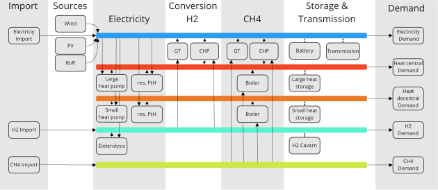

.. _overview_label:

~~~~~~~~
Overview
~~~~~~~~

Oemof-B3 is an energy system model of Berlin and Brandenburg. It represents many sectors:
Electricity, central and decentral heat, hydrogen, CO2 and methane. It is a multi-node-model, which
means that several distinct regions are represented that are connected via transmission lines.

The model is a perfect-foresight, cost minimizing linear optimization model based on
`oemof.solph <https://github.com/oemof/oemof-solph>_`,
`oemof.tabular <https://github.com/oemof/oemof-tabular>_`
and `oemoflex <https://github.com/rl-institut/oemoflex>_`

Oemof-B3 is currently under heavy development, which means that first full scenario runs will be
available in the coming months.